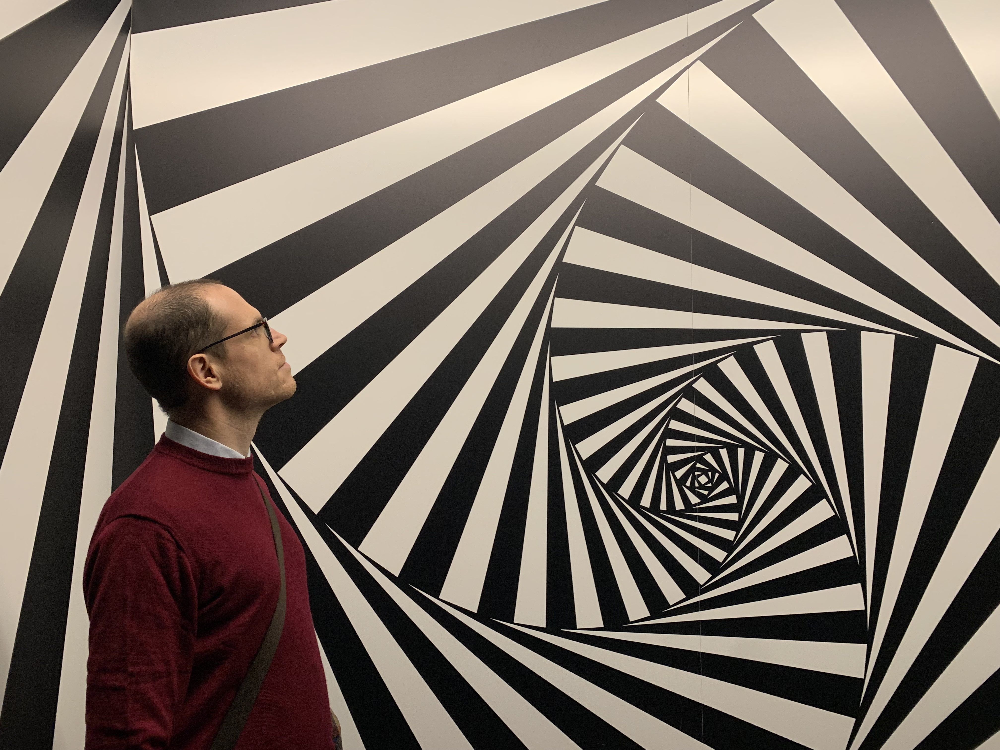

::: {.hero #about}
::: {.hero-copy}
# Amos Turchet

**Associate Professor of Mathematics · Università degli Studi Roma Tre**

I am an Associate Professor in the [Dipartimento di Matematica e Fisica](https://matematicafisica.uniroma3.it) of [Università degli Studi Roma Tre](https://www.uniroma3.it) in Rome.

My research is in **Diophantine geometry, arithmetic geometry, algebraic geometry, and number theory**.

[Curriculum vitae](files/aturchetCV.pdf){.btn .btn-primary} [ORCID](https://orcid.org/0000-0003-3411-2521){.btn .btn-outline-primary} [GitHub](https://github.com/amosturchet){.btn .btn-outline-primary}
:::
::: {.hero-photo}
{fig-alt="Portrait of Amos Turchet" .profile-photo}
:::

:::
::: {.contact-details}
[Contact]{.contact-title}

::: {.contact-row}
[]{.bi .bi-envelope} [amos(DOT)turchet(AT)uniroma3.it](mailto:amos.turchet@uniroma3.it)
:::

::: {.contact-row}
[]{.bi .bi-telephone} [tel. (+39 06 5733) 8244]()
:::

::: {.contact-row}
[]{.bi .bi-geo-alt}
Ufficio C.1.013
Largo S. L. Murialdo 1,
Dipartimento di Matematica e Fisica  
Università degli Studi Roma Tre  
00146 Roma, Italy
:::

:::

I was previously a Junior Visitor at Scuola Normale Superiore under the mentorship of [Umberto Zannier](https://www.sns.it/en/zannier-umberto), an Acting Assistant Professor at the University of Washington under the mentorship of [Bianca Viray](https://sites.math.washington.edu/~bviray/), and a Postdoctoral Researcher at Chalmers University of Technology under the mentorship of [Per Salberger](https://www.chalmers.se/en/staff/Pages/salberg.aspx).

I received my Ph.D. in Mathematics on May 29, 2014, from the University of Udine under the supervision of [Pietro Corvaja](https://www.dmif.uniud.it/persone/pietro.corvaja/), with the thesis *Geometric Lang-Vojta Conjecture in the projective plane*.

I organize the [Geometry Seminars](http://ricerca.matfis.uniroma3.it//users/geometria/seminarigeometria.html) of the [Geometry group](https://matematicafisica.uniroma3.it/ricerca/linee-di-ricerca/Geometria/) at Roma Tre.

## Research {#research}

### Publications

[The list below is generated from [`publications.bib`](publications.bib). To add or update a paper, edit the BibTeX entry and rebuild the site.]: #

::: {#publication-list}
:::

### Other

::: {#other-list}
:::

## Teaching {#teaching}

### Università di Roma Tre

#### 2025–2026

- Geometria (Ingegneria Elettronica) — [Moodle](https://ingegneriaindustrialeelettronicameccanica.el.uniroma3.it/course/view.php?id=1600)
- AL 410: Algebra Commutativa — [Moodle](https://matematicafisica.el.uniroma3.it/course/view.php?id=1609)
- Group Cohomology and Galois Cohomology (PhD) — [course page](group_coh.html)

#### 2024–2025

- Geometria (Ingegneria Elettronica) — [Moodle](https://ingegneriaindustrialeelettronicameccanica.el.uniroma3.it/course/view.php?id=1415)
- GE 510: Geometria Algebrica 2 — [Moodle](https://matematicafisica.el.uniroma3.it/course/view.php?id=1404)
- Abelian Varieties (PhD) — [course page](abelian.html)

#### 2023–2024

- CR 510: Crittosistemi Ellittici — [Moodle](https://matematicafisica.el.uniroma3.it/course/view.php?id=1322)
- Geometria (Ingegneria Elettronica) — [course page](geo_ing_2023.html)

#### 2022–2023

- CR 510: Crittosistemi Ellittici — [Moodle](https://matematicafisica.el.uniroma3.it/course/view.php?id=1128)
- GE 110: Geometria e Algebra Lineare 1 (esercitazioni) — [course page](GE110_2023.html)

#### 2021–2022

- GE 220: Topologia — [Moodle](https://matematicafisica.el.uniroma3.it/course/view.php?id=337)
- GE 110: Geometria e Algebra Lineare 1 (esercitazioni)

#### 2020–2021

- GE 450: Topologia Algebrica
- GE 220: Topologia (esercitazioni)

### University of Washington

- MATH 308: Matrix Algebra and Applications (multiple sections)
- MATH 340: Abstract Linear Algebra
- MATH 582: Diophantine Geometry of Curves (graduate course)
- MATH 402: Introduction to Modern Algebra

### Chalmers University of Technology

- Scheme Theory (graduate course)
- MVE 085: Multivariable Calculus (exercise and Matlab sessions)
- MVE 016: Calculus II (exercise and Matlab sessions)

### Università degli Studi di Udine

- Matematica Discreta per Informatica (exercise sessions)
- Matematica per Architettura (exercise sessions)

### Reading courses

- [Uniform Mordell](uniformity.html) (after Dimitrov–Gao–Habegger)

## Positions {#positions}

::: {.position-list}
::: {.position-item}
**Università di Roma Tre**  
Associate Professor

November 2023–present
:::

::: {.position-item}
**Università di Roma Tre**  
Ricercatore a Tempo Determinato di tipo B (tenure track)

November 2020–October 2023
:::

::: {.position-item}
**Scuola Normale Superiore di Pisa**  
Junior Visiting Position

September 2019–October 2020
:::

::: {.position-item}
**University of Washington — Seattle, USA**  
Acting Assistant Professor

September 2016–June 2019
:::

::: {.position-item}
**Chalmers University of Technology — Göteborg, Sweden**  
Postdoctoral Researcher

August 2014–July 2016
:::
:::

## Useful Links {#links}

::: {.columns}
::: {.column width="50%"}
### Coauthors

- [Kenny Ascher](https://www.math.uci.edu/~kascher/)
- [Fabrizio Barroero](https://sites.google.com/site/barroerofabrizio/)
- [Lucas Braune](https://lucasbraune.github.io)
- [Lucia Caporaso](http://www.mat.uniroma3.it/users/caporaso/caporaso.html)
- [Laura Capuano](https://sites.google.com/site/lauracapuano1987/)
- [Pietro Corvaja](https://www.uniud.it/it/ateneo-uniud/ateneo-uniud-organizzazione/dipartimenti/dmif/ricerca/@@cercapersone_detail?person-id=1724926c947ec313cc613f7b9a7d127c)
- [Pranabesh Das](https://sites.google.com/site/pranabeshdas2124161605/home?authuser=0)
- [Kristin DeVleming](http://www.math.umass.edu/~devleming/)
- [Carlo Gasbarri](https://arxiv.org/search/math?searchtype=author&query=Gasbarri,+C)
- [Erwan Rousseau](http://eroussea.perso.math.cnrs.fr)
- [Julie Tzu-Yueh Wang](https://www.math.sinica.edu.tw/www/people/websty1_14e.jsp?owner=jwang)
- [Wern Yeong](https://sites.google.com/view/wyeong/home)
- [Umberto Zannier](https://www.sns.it/en/zannier-umberto)
:::

::: {.column width="50%"}
### Resources and events

- [Math arXiv](https://arxiv.org/archive/math)
- [MathSciNet](https://mathscinet.ams.org/mathscinet/)
- [Practical suggestions for mathematical writing](http://www-math.mit.edu/~poonen/papers/writing.pdf) — Poonen
- [Practical suggestions for mathematical writing](https://www.ams.org/journals/notices/202106/rnoti-p930.pdf) — Bell, Kadets, Srinivasan, Triantafillou, and Vogt
- [Mathematics Genealogy Project](https://www.genealogy.math.ndsu.nodak.edu)
- [Lean Community](https://leanprover-community.github.io/index.html)
- [CoCalc](https://cocalc.com)
- [Conferences in Algebraic Geometry](http://math.stanford.edu/~vakil/conferences.html) — Vakil
- [Conferences in Arithmetic Geometry](https://kskedlaya.org/confs.cgi) — Kedlaya
- [Conferences in Number Theory](http://www.numbertheory.org/ntw/N3.html)
- [Nordic Number Theory Network](http://www.n-cube.net)
- [Winter Meeting in Algebra and Geometry](alggeo25.html)
- [Roman Number Theory Association](http://www.rnta.eu)
- [Roma Tre Geometry Seminars](http://ricerca.matfis.uniroma3.it//users/geometria/seminarigeometria.html)
- [Number Theory events in Roma](https://sites.google.com/site/lauracapuano1987/number-theory-in-rome?authuser=0)
:::
:::
